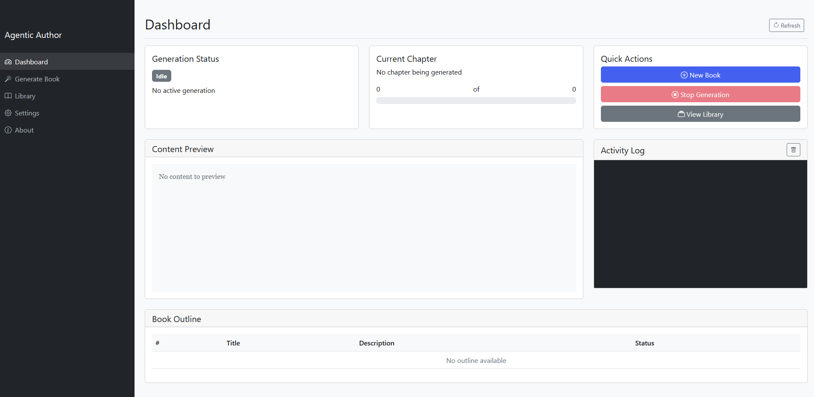
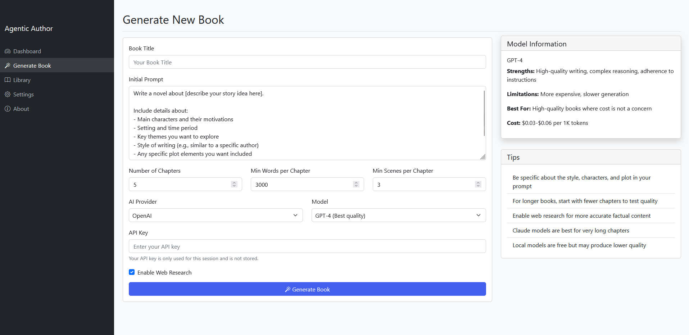

# Agentic Author

A sophisticated AI-powered book generation system that creates complete novels in the style of famous authors. This project extends and enhances [Adam Larson's original AI Book Writer](https://github.com/adamwlarson/ai-book-writer) with multiple new features and improvements.



## 🌟 Key Features

- **Beautiful Web Interface**:
  - Real-time generation progress tracking
  - Live content preview as chapters are written
  - Book library management
  - Detailed logs and status updates

- **Multiple AI Provider Support**:
  - OpenAI (GPT-4, GPT-3.5)
  - Anthropic Claude (with extended thinking capability)
  - Local LLMs via LM Studio (no API keys needed)

- **Customizable Book Parameters**:
  - Adjustable chapter length
  - Configurable number of scenes per chapter
  - Control over total chapter count
  - Temperature settings for creativity

- **Enhanced Generation Quality**:
  - Improved prompting for better adherence to writing style
  - Automatic chapter extension for consistent length
  - Web research integration for factual accuracy
  - Resilient API handling with automatic retries

- **Professional Output**:
  - Complete book with title page and table of contents
  - Properly formatted chapters with epigraphs
  - Consistent character development
  - Cohesive narrative structure

## 📋 Requirements

### For Cloud API Version
- Python 3.8+
- OpenAI API key and/or Anthropic API key
- Required Python packages (see requirements.txt)

### For Local LLM Version
- Python 3.8+
- [LM Studio](https://lmstudio.ai/) with a downloaded model
- Sufficient RAM for your chosen model (8GB+ recommended)
- GPU acceleration recommended but not required

## 🚀 Quick Start

### Installation

```bash
# Clone the repository
git clone https://github.com/jpautrat/agentic-author.git
cd agentic-author

# Create a virtual environment
python -m venv venv

# Activate the virtual environment
# On Windows:
venv\Scripts\activate
# On macOS/Linux:
source venv/bin/activate

# Install dependencies
pip install -r requirements.txt
```

### Usage with Web UI

The easiest way to use the Advanced AI Book Generator is through its beautiful web interface:

```bash
# On Windows:
run_with_ui.bat

# On macOS/Linux:
./run_with_ui.sh
```

This will start a local web server and open the interface in your default browser. From there, you can:

1. Configure your book parameters
2. Choose your AI provider and model
3. Monitor generation progress in real-time
4. View and download completed books

### Command-Line Usage

If you prefer command-line usage, you can use the following scripts:

#### Using OpenAI API

```bash
# Set up OpenAI configuration
setup_openai.bat  # Windows
# OR
./setup_openai.sh  # macOS/Linux

# Run the generator
openai_run.bat  # Windows
# OR
./openai_run.sh  # macOS/Linux
```

#### Using Anthropic Claude API

```bash
# Run the Claude-powered generator
claude_book_resilient.bat  # Windows
# OR
./claude_book_resilient.sh  # macOS/Linux
```

#### Using Local LM Studio

```bash
# First, start LM Studio and enable the local server

# Then run the local generator
local_book.bat  # Windows
# OR
./local_book.sh  # macOS/Linux
```

## 📚 Web Interface

The web interface provides a user-friendly way to interact with the book generator:

### Dashboard


- Real-time generation status
- Progress tracking
- Live content preview
- Activity log

### Book Generation


- Customizable parameters
- Multiple AI provider options
- Model information and recommendations

### Library


- View and manage generated books
- Preview content
- Download books

## 🔧 Advanced Configuration

### Customizing Book Parameters

When using the web interface, you can easily configure:

1. Number of chapters (1-20)
2. Minimum words per chapter (1000-50000)
3. Minimum scenes per chapter (1-20)
4. AI provider and model
5. Web research settings

### Environment Variables

Create a `.env` file with the following variables:

```
# API Keys (for cloud versions)
OPENAI_API_KEY=your_openai_api_key_here
ANTHROPIC_API_KEY=your_anthropic_api_key_here

# Book Generation Settings
MIN_CHAPTER_LENGTH=5000
MAX_RETRIES=3
```

## 🧠 Architecture

The system uses several specialized agents working together:

- **Story Planner**: Creates high-level story arcs and plot points
- **World Builder**: Establishes and maintains consistent settings
- **Memory Keeper**: Tracks continuity and context
- **Writer**: Generates the actual prose
- **Editor**: Reviews and improves content
- **Outline Creator**: Creates detailed chapter outlines

## 🤝 Contributing

Contributions are welcome! Please feel free to submit a Pull Request.

This project builds upon [Adam Larson's AI Book Writer](https://github.com/adamwlarson/ai-book-writer). We extend our gratitude for his foundational work that made this enhanced version possible.

## 📄 License

This project is licensed under the MIT License - see the [LICENSE](LICENSE) file for details.

## 🙏 Acknowledgments

- [Adam Larson](https://github.com/adamwlarson) for the original AI Book Writer project
- [AutoGen](https://github.com/microsoft/autogen) framework for multi-agent capabilities
- OpenAI and Anthropic for their powerful language models
- The LM Studio team for making local LLM inference accessible
